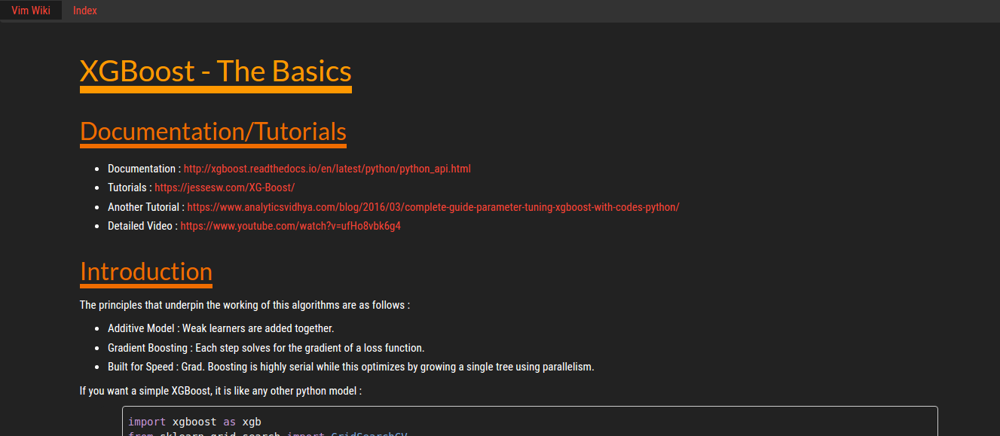
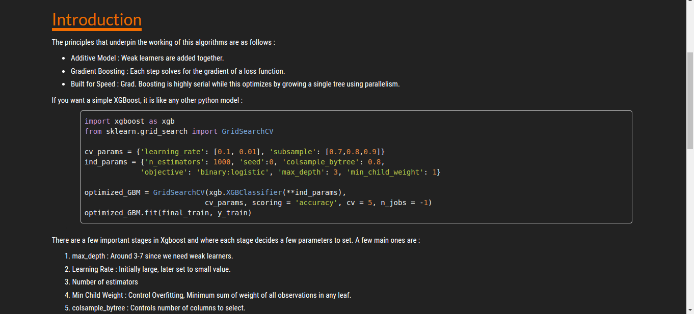

# Dark Vimwiki HTML Template

This a dark themed template for [Vimwiki](https://github.com/vimwiki/vimwiki). Vimwiki is a plugin for Vim useful for markdown style note making.

VIMRC Config :
--------------

The following is relevant portion of my .vimrc 
```vim
let g:vimwiki_list = [{'path': '$HOME/Documents/vim/wiki',
		  \ 'template_path': '$HOME/Documents/vim/wiki/templates',
		  \ 'template_default': 'def_template',
		  \ 'template_ext': '.html'}]

# add the pre tag for inserting code snippets
let g:vimwiki_valid_html_tags = 'b,i,s,u,sub,sup,kbd,br,hr, pre, script'
```

Code Snippets :
---------------
It is possible to insert syntax highlited code. This template makes use of a themed version of [Google code Prettify](https://github.com/google/code-prettify). The following is a Vimwiki example for inserting a code snippet.

```vimwiki
= Snippet Example = 
<pre class ="prettyprint lang-cpp"> 
{{{cpp
	#include <iostream>

	int main(void){
		return 0;
	}
}}}
</pre>
```

Setup :
-------
Refer to vimwiki documentation regarding templates, since it is very thoroughly dealt with there.

1. The Template *def_template.html* is present in the 'wiki/' folder. Ensure that it is copied to the location specified by the template path variable in your vimrc. 

2. On running vimwiki2HTML, you will get the HTML pages generated in the 'wiki\_html' folder present in your system . The file should be relative to your vimwiki path set in your vimrc.

2. Copy the files(css and js files) in the directory 'wiki\_html' present in this repo, into 'wiki\_html' files present in your system.


Screenshots :
-------------





